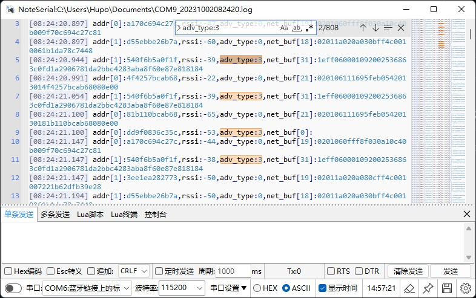
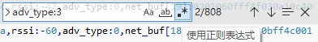
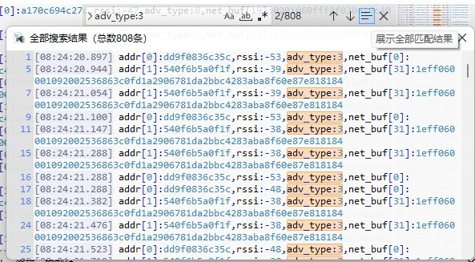
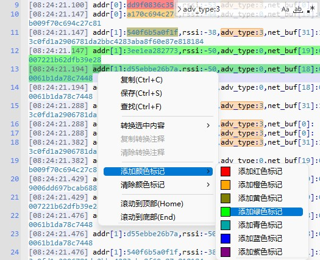

# NoteSerial简介
NoteSerial是一款用于Windows平台的串口日志查看工具，可以像VScode一样搜索查找日志，支持Lua脚本插件（待完善中），同时作者独创了一些特色工具，工具采用C语言原生GUI开发，安装包仅1MB大小，小巧而强大。

# 功能汇总
NoteSerial具体功能如下：（部分还在开发完善中，敬请期待）
| 功能 | 描述 | 完成情况 |
| ---- | --- | ------ |
| 日志着色器 | 根据规则对日志进行着色 | ✔ |
| 日志查找器 | 类似VScode对日志进行查找搜索 | ✔ |
| 日志结果展示器 | 将日志的查找结果所在行全部提取到独立窗口进行展示，并能通过双击展示内容同步定位原日志 | ✔ |
| 日志手动颜色标记 | 右键菜单可对选中文本进行颜色标记 | ✔ |
| 选中内容转换功能 | 右键菜单将选中内容进行特定格式的转换 | 仅实现部分 |
| 正则表达式查找 | 采用非std的正则库，优化提高匹配速度 | ✔ |
| 清理串口端口占用功能 | 清理系统的串口端口占用，释放更多的端口，新设备将重新分配端口号 | ✔ |
| 数据发送功能 | 单条和多条的发送功能，添加Esc转义功能（支持\r\n\x等）| ✔ |
| HEX格式显示功能 | 可将接收到的串口内容转换为HEX格式并显示 | 仅部分实现 |
| minmap导航栏 | 日志文本的缩小地图滚动栏 | ✔ |
| 日志文件拖入打开 | 支持将文件拖入到日志窗口进行打开查看 | ✔ |

# 截图

主界面:

查找栏：

查找结果展示窗口：

手动颜色标记：

